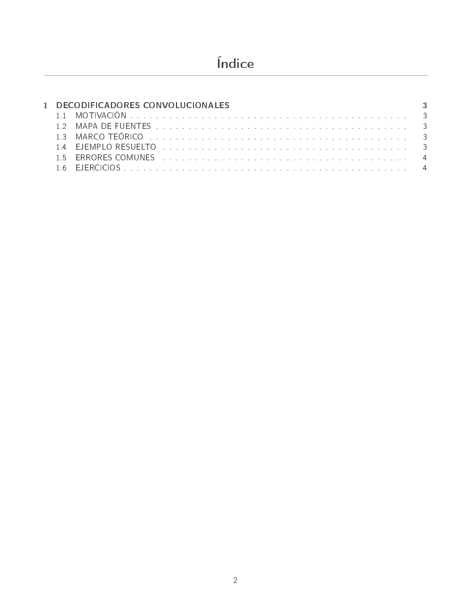
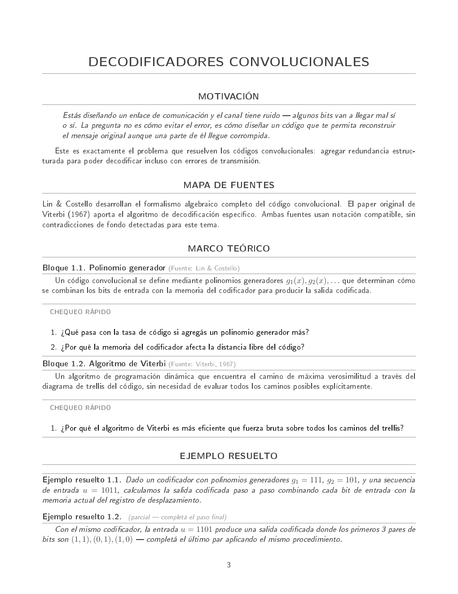
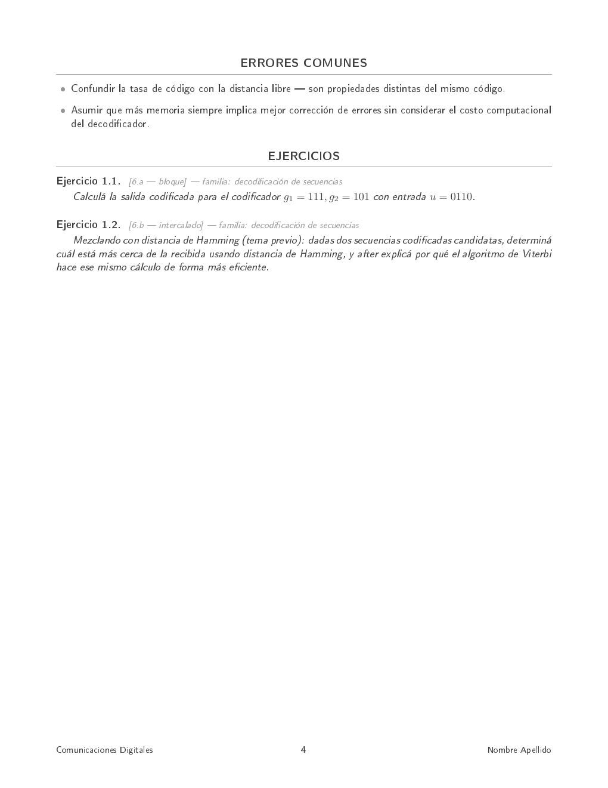

<div align="center">

# 📚 syntheca

### Convertí tus libros, cátedras y exámenes viejos en tu propio libro de estudio — escrito por un pipeline de agentes que sigue reglas reales de neurociencia del aprendizaje, no intuición.

<sub>*syntheca* — de *synthesis*: no resume tus fuentes, las sintetiza en algo nuevo, calibrado a vos.</sub>

[](LICENSE)
[](#-roadmap)
[](https://claude.com/claude-code)
[](docs/assets/ejemplo-marco-teorico.png)
[](#-por-qué-esto-no-es-otro-generador-de-apuntes)

</div>

---

## El problema

Pedirle a un LLM que "te haga un resumen de este libro" produce un resumen genérico, con el nivel de detalle equivocado, sin conexión con tus fuentes reales, y sin ninguna garantía de que el formato en el que se te presenta la información sea el que efectivamente ayuda a que la retengas.

**syntheca** no es eso. Es un plugin de [Claude Code](https://claude.com/claude-code) que orquesta un pipeline de 7 agentes especializados para producir síntesis teóricas propias — calibradas a tu perfil académico real, construidas a partir de tus fuentes elegidas (no fuentes genéricas de internet), con el formato de ejercicios de tu propia cátedra, y estructuradas siguiendo principios de aprendizaje con respaldo empírico, no "sentido común pedagógico".

---

## 🧠 Por qué esto no es "otro generador de apuntes"

La capa que decide **cómo** se redacta cada síntesis (`skills/pedagogia-cognitiva/`) no es una lista de buenas prácticas inventadas — es la fusión sintetizada de 4 obras de ciencia cognitiva y neurociencia del aprendizaje, 28 capítulos, con reglas atribuidas a su fuente:

| Obra | Qué aporta al sistema |
|---|---|
| **How Learning Works** (Ambrose, Bridges, DiPietro, Lovett, Norman) | Diagnóstico de conocimiento previo, motivación (valor × expectativa de éxito), práctica dirigida a objetivo, clima de aprendizaje |
| **Make It Stick** (Brown, Roediger, McDaniel) | Testing effect, interleaving, dificultades deseables, calibración honesta |
| **Why Don't Students Like School?** (Willingham) | Memoria como residuo del pensamiento, estructura superficial vs. profunda, cognición temprana vs. experta |
| **Cognitive Load Theory in Action** (Lovell, Sherrington — sobre la obra de Sweller) | *Expertise-reversal effect*, *split-attention effect*, *redundancy effect*, *worked example effect*, *goal-free effect* |

Varios hallazgos quedaron **confirmados por 2-3 fuentes independientes** dentro del propio corpus (el mito de los "estilos de aprendizaje", la ilusión de competencia, el efecto de generación) — no son una opinión de una sola fuente, son un patrón replicado.

Ejemplos concretos de reglas que esto produce, con nombre y apellido:

- El nivel de andamiaje de un ejemplo resuelto se calibra **por sub-dominio específico, nunca de forma global** — es la aplicación directa del *expertise-reversal effect*.
- Un diagrama y su texto explicativo **nunca quedan separados** en el documento — es el *split-attention effect*, no una preferencia estética.
- Las fórmulas **no están exceptuadas** del minimalismo visual — el *redundancy effect* aplica también a la notación densa.
- Los ejercicios intercalados solo mezclan conceptos de la **misma familia** — criterio de discriminación de Goldstone, no variedad porque sí.

---

## ⚙️ Cómo funciona — arquitectura en 5 capas + pipeline de agentes

```
┌───────────────────────────────────────────────────────────────────┐
│  skills/pedagogia-cognitiva/   → CÓMO enseñar (universal,         │
│                                    compartida entre TODAS         │
│                                    tus materias)                  │
│  skills/perfil-academico/      → QUIÉN sos vos como lector        │
│                                    (4 dimensiones, 12 campos)     │
│  skills/fuentes/                → TUS libros y papers, uno        │
│                                    por fuente, sin fusionar       │
│  skills/herramientas/           → OPCIONAL: simulador / lenguaje  │
│                                    / diagrama de arquitectura     │
│  skills/banco-ejercicios/       → OPCIONAL: tus TPs, parciales    │
│                                    y finales reales               │
└───────────────────────────────────────────────────────────────────┘
                              │
                              ▼
        /generar-sintesis "<tema>" --materia X --fuentes a,b
                              │
   ┌──────────────────────────┴──────────────────────────┐
   ▼                                                       ▼
conciliador-fuentes → calibrador-perfil → (mapeador-herramienta)
   → (estilista-ejercicios) → redactor-pedagogico
   → (verificador-numerico) → critico-calidad [GATE DURO]
                              │
                              ▼
              capítulo nuevo en tu libro LaTeX/PDF
              + actualización de mapa-estudio.json
```

- **Condicionales** (`mapeador-herramienta`, `estilista-ejercicios`, `verificador-numerico`) solo se disparan si el tema los necesita — no fuerzan una herramienta ni un banco de ejercicios donde no aplican.
- **`critico-calidad` es un gate duro**: nada se entrega sin pasar chequeo estructural (`rubric_check.py`) y, si hay ejercicios numéricos, verificación independiente por código — nunca se confía en la autoevaluación del propio texto generado.
- El **verificador numérico se entrega también a vos**: el script que chequea los ejercicios no queda escondido en el pipeline, se copia junto a tu síntesis para que aprendas a verificar resultados vos mismo.

📄 Documento de arquitectura completo, con el razonamiento de cada decisión: [`docs/ARCHITECTURE.md`](docs/ARCHITECTURE.md)

---

## 📖 Cada tema es un capítulo — tu materia se convierte en tu propio libro

La plantilla de salida es LaTeX, clase `book`. Cada síntesis que generás **no es un PDF suelto** — es un capítulo nuevo que se suma al documento de esa materia. Con el tiempo, dejás de tener "apuntes" y pasás a tener, literalmente, tu propio libro de cada materia, con tu tipografía, tu estructura, calibrado a vos.

<table>
<tr>
<td width="33%"></td>
<td width="33%"></td>
<td width="33%"></td>
</tr>
</table>

Entornos LaTeX custom incluidos — `bloque`, `ejemplo[completo|parcial]`, `chequeo`, `ejercicio[familia]`, `erroresComunes`, `motivacion` — todos con la misma estética minimalista (gris, líneas finas, sin decoración que no cumpla una función). Ver [`skills/plantilla-sintesis/latex/`](skills/plantilla-sintesis/latex/).

---

## ✨ Features

- 🎯 **Calibración real por perfil**, no un "nivel" genérico — 4 dimensiones (competencias, motivación, obstáculos, secuenciación), y el nivel de andamiaje se trackea **por sub-dominio específico**, nunca global.
- 📚 **Multi-fuente con conciliación explícita** — combinás varios libros/papers por síntesis; si se contradicen, el sistema lo muestra atribuido, nunca lo diluye en una sola voz sin avisar.
- 🔁 **Interleaving con criterio, no al azar** — blocked practice primero, después solo se intercalan conceptos de la misma familia, con dificultad creciente en cada reaparición.
- 🧪 **Verificación numérica independiente** — los ejercicios con resultado calculable se chequean por código, no por la palabra del propio redactor, y el script queda para que lo uses vos.
- 📝 **Calibrado a TUS exámenes reales** — subís tus TPs/parciales/finales viejos y los ejercicios nuevos imitan el formato exacto de tu cátedra (parafraseado, nunca copiado literal).
- 🛠️ **Con o sin herramienta** — simulador, lenguaje de descripción de hardware, diagrama de arquitectura, o nada — la plantilla se adapta sin forzar una sección que no aplica.
- 📖 **Salida LaTeX profesional**, clase `book`, con entornos semánticos propios — compila a PDF real, no un markdown suelto.

---

## 🚀 Instalación

```bash
git clone https://github.com/PedroMVillar/syntheca.git
cd syntheca
```

Dentro de Claude Code:

```
/plugin install ./syntheca
```

**Requisitos:** Python 3 (para los scripts de verificación) y una distribución LaTeX con `pdflatex` (para compilar la salida). Verificá antes de arrancar:

```bash
python3 --version
pdflatex --version
```

---

## 🏁 Guía rápida de uso

```bash
# 1. Perfil académico (una sola vez)
/setup-perfil

# 2. Ingestá tu bibliografía — un comando por fuente
/nueva-fuente <libro.pdf>

# 3. (Opcional) Herramienta de la materia
/nueva-herramienta <nombre> --tipo simulador|lenguaje|diagrama-arquitectura

# 4. (Opcional) Tus TPs/parciales/finales reales — agrupados por tipo
/nuevo-banco-ejercicios <tp1.pdf,tp2.pdf,...> <materia> --tipo tp
/nuevo-banco-ejercicios <parcial1.pdf,parcial2.pdf,...> <materia> --tipo parcial
/nuevo-banco-ejercicios <final1.pdf,...> <materia> --tipo final

# 5. Generá tu primer capítulo
/generar-sintesis "Cinemática 1D" --materia fisica-1 --fuentes libro-x --estilo fisica-1

# 6. Consultá tu progreso cuando quieras
/mapa-estudio fisica-1
```

Guía completa, con recomendaciones de orden y cómo cargar el cronograma de la materia: [`docs/USAGE.md`](docs/USAGE.md).

---

## 📂 Estructura del repo — qué es el plugin, qué son tus datos

```
syntheca/
├── .claude-plugin/plugin.json     ← manifiesto del plugin
├── agents/                        ← 7 subagentes (el "cerebro" del pipeline)
├── commands/                      ← comandos /slash
├── hooks/, scripts/               ← quality gate automático
├── skills/
│   ├── pedagogia-cognitiva/       ← ✅ se distribuye CON el repo (28 capítulos)
│   ├── plantilla-sintesis/        ← ✅ se distribuye CON el repo (LaTeX + estructura)
│   ├── perfil-academico/
│   │   ├── SKILL.md.template      ← ✅ template versionado
│   │   └── SKILL.md               ← ❌ TUS datos reales — gitignored
│   ├── fuentes/                   ← ❌ tu bibliografía ingestada — gitignored
│   ├── herramientas/              ← ❌ tus herramientas configuradas — gitignored
│   └── banco-ejercicios/          ← ❌ tus TPs/parciales/finales — gitignored
├── mapa-estudio.json              ← ❌ tu progreso — gitignored
└── sintesis/                      ← ❌ tus apuntes generados — gitignored
```

Esta separación es deliberada: lo que hace valioso al repo (la pedagogía, la orquestación, la plantilla) es genérico y se comparte; lo que generás usándolo es tuyo, personal, y potencialmente cubierto por derechos de autor de tu cátedra — nunca debería terminar en un repo público sin que lo decidas explícitamente.

---

## 🗺️ Roadmap

- [x] `pedagogia-cognitiva` — 4 fuentes fusionadas (28 capítulos)
- [x] Los 7 agentes + 7 comandos + quality gate
- [x] Plantilla LaTeX (clase `book`, entornos custom, compilada y verificada)
- [ ] Fusionar *Understanding by Design* (Wiggins & McTighe) a `pedagogia-cognitiva` — fuente grande, pendiente por tamaño
- [x] `/cargar-programa` — carga temas y agrupación por examen desde el cronograma
- [ ] Diagramas progresivos vs. estáticos — regla pendiente de fuente adicional
- [ ] Explorar repetición espaciada real entre sesiones (más allá del interleaving intra-documento)
- [x] Generación de exámenes de prueba — parciales nuevos, con la misma estructura y curva de dificultad que los reales (vía `skills/banco-ejercicios/`), pero con contenido inédito para practicar en condiciones simuladas
- [ ] Mismo mecanismo para finales — exámenes de prueba integradores que combinan varias unidades del programa, siguiendo el patrón de `--tipo final`
- [x] Mapas mentales por parcial — a partir de los temas que cubre cada parcial (ya identificables por el cronograma), generar un mapa de conexiones entre conceptos como herramienta de repaso visual, no como reemplazo de la síntesis textual
- [ ] Quizzes de opción múltiple — modo de autoevaluación rápida adicional al testing effect ya incrustado en cada síntesis (adjunct questions), pensado para repaso spaced/on-demand más que para el documento en sí

---

## 🤝 Contribuir

Ver [`CONTRIBUTING.md`](CONTRIBUTING.md). Ideas especialmente bienvenidas: nuevas fuentes pedagógicas para fusionar, mejoras a los entornos LaTeX, soporte para otras clases de documento.

---

## 🙏 Agradecimientos

`skills/pedagogia-cognitiva/` es una síntesis original elaborada a partir de la lectura de:

- Ambrose, S. A., Bridges, M. W., DiPietro, M., Lovett, M. C., & Norman, M. K. — *How Learning Works: Seven Research-Based Principles for Smart Teaching*
- Brown, P. C., Roediger, H. L., & McDaniel, M. A. — *Make It Stick: The Science of Successful Learning*
- Willingham, D. T. — *Why Don't Students Like School?*
- Lovell, O., & Sherrington, T. — *Cognitive Load Theory in Action* (sobre la obra de John Sweller)

Si te sirve este proyecto, considerá leer las obras originales — este repo es una herramienta para aplicar sus ideas, no un reemplazo de ellas.

---

## 📄 Licencia

[MIT](LICENSE)
